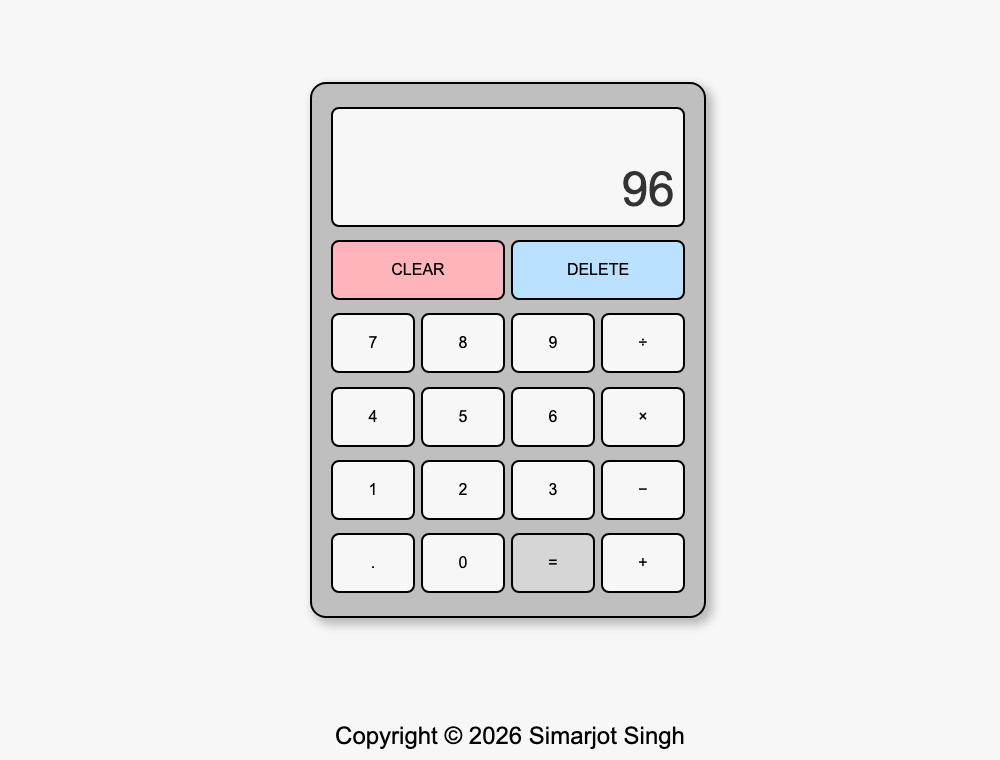

# Calculator

A browser calculator built with plain HTML, CSS, and JavaScript. One of
[The Odin Project](https://www.theodinproject.com/) foundations exercises.

## Run it

Open `index.html` in a browser. No build step.

## How it works

`app.js` keeps three pieces of state: `num1`, `num2`, and the pending
`operation`. Clicking a digit appends to whichever operand is active; clicking an
operator stores it and moves to the second operand; `=` calls `evaluate()`, which
runs the matching arithmetic function and puts the result back on the display.

Details handled:

- Display is capped at 9 digits
- `C` clears everything, `DEL` removes the last digit
- Decimal point can only be added once per number
- Chaining operations reuses the previous result as `num1`

## Built with

HTML · CSS · vanilla JavaScript

## License

Released under the [MIT License](LICENSE).
